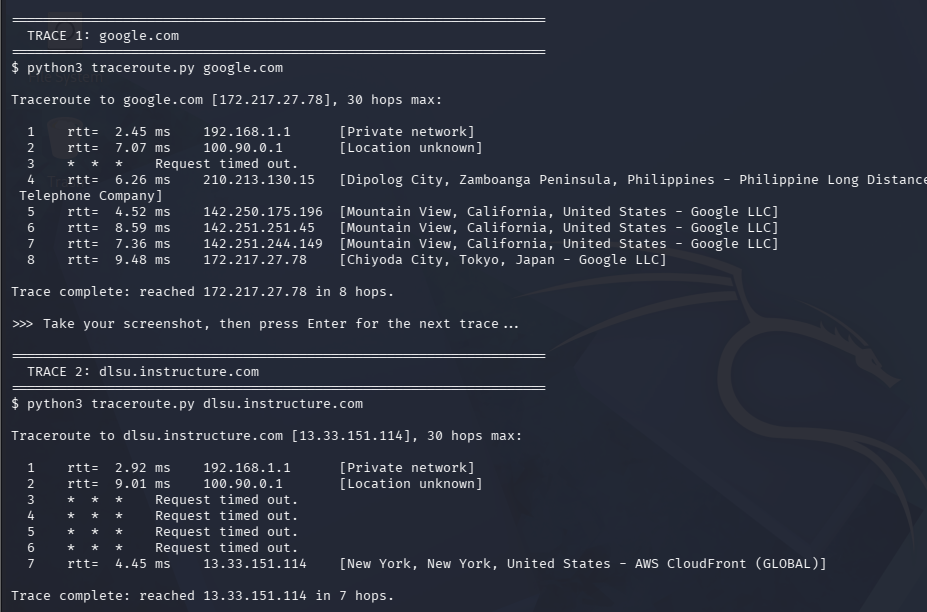
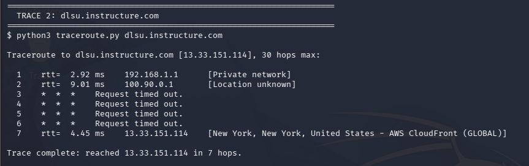
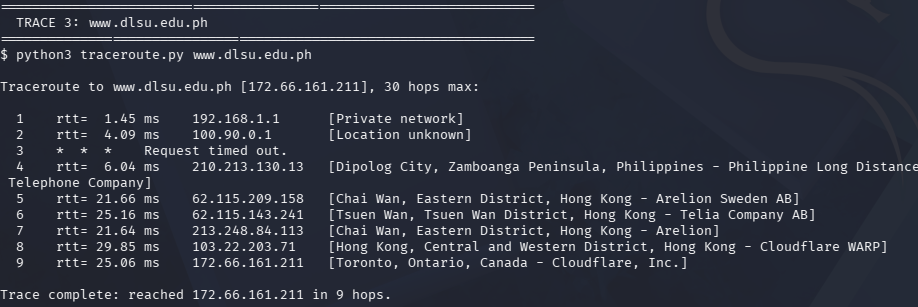
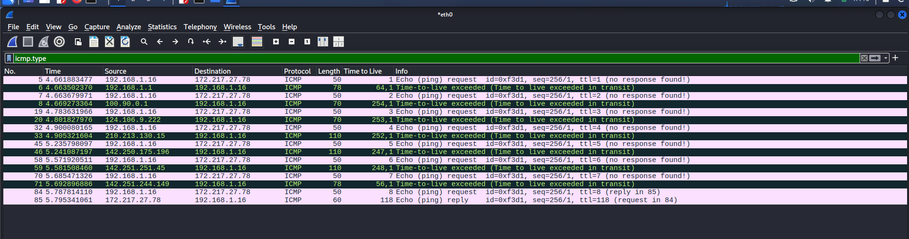

# MCO2: Traceroute Tool Using ICMP — Documentation

**Student 1:** Lorenzo Enrique Suerte

**Student 2:** Christian Gabriel Sanidad

**Section:** S04

**Date:** 08/13/2026

---

## 1. Overview

This document presents the test cases for a custom traceroute tool implemented in
Python using raw sockets. The program sends ICMP Echo Requests toward a destination
with an increasing time-to-live (TTL). Each router that decrements the TTL to zero
returns an ICMP Time Exceeded (type 11) message revealing its IP address; the final
destination answers with an ICMP Echo Reply (type 0), which ends the trace. For every
hop the program records and displays the hop number, round-trip time (RTT) in
milliseconds, and the responding IP address. The ICMP packet construction and
checksum are reused from our MCO1 submission (Custom Ping Utility Using ICMP), as
permitted by the specification.

**Bonus implemented — IP Geolocation:** each responding hop is looked up via the
ip-api.com service and its City, Region, Country, and Organization (ISP or hosting
provider) are displayed beside the IP address.

**Test environment:** Kali Linux, Python 3. All tests were run with root privileges
(`sudo`) because raw sockets require them; the traces were executed through the
`run_tests_mco2.sh` test runner. Packet-level behavior was additionally verified
with Wireshark (Section 3).

---

## 2. Test Cases

### 2.1 Trace 1 — google.com

Command: `sudo python3 traceroute.py google.com`



**Description:** The hostname google.com resolved to 172.217.27.78 and the
destination was reached in 8 hops, with per-hop RTTs between 2.45 ms and 9.48 ms.
Hop 1 is the home router (192.168.1.1, [Private network]); hop 2 (100.90.0.1) is in
the carrier-grade NAT range 100.64.0.0/10, which has no public geolocation, hence
[Location unknown]; hop 3 did not answer within the timeout (* * *); hop 4 is a PLDT
router (210.213.130.15, Dipolog City, Philippines); hops 5–7 are Google LLC backbone
routers (address blocks registered to Mountain View, California); and hop 8 is the
destination front-end server, geolocated to Chiyoda City, Tokyo, Japan — the Google
edge node serving the Philippines. The trace terminated correctly on the Echo Reply
with "Trace complete."

### 2.2 Trace 2 — dlsu.instructure.com

Command: `sudo python3 traceroute.py dlsu.instructure.com`



**Description:** The hostname dlsu.instructure.com resolved to 13.33.151.114 and was
reached in 7 hops. After the home router and the carrier-grade NAT hop, hops 3–6 all
timed out — these intermediate routers suppress ICMP Time Exceeded responses, which
is common on paths into commercial cloud networks and is exactly the situation the
`* * *` output is designed to report. The destination answered with an RTT of only
4.45 ms and is identified by the geolocation bonus as AWS CloudFront (GLOBAL).
CloudFront is Amazon's anycast content-delivery network: the database places the
address in New York, but the low RTT shows the request was actually served by a
nearby edge node — a good illustration of why anycast geolocation reflects the
registered owner rather than physical distance.

### 2.3 Trace 3 — www.dlsu.edu.ph

**Note on the target host:** the host listed in the requirements, `dlsu.edu.ph`, has
no A (IPv4) record — verified with `dig +short dlsu.edu.ph A`, which returns
nothing — so it cannot be resolved by any traceroute implementation. The program
reports this cleanly ("cannot resolve") and suggests the www subdomain; the trace
was therefore performed against `www.dlsu.edu.ph`, the same site's web host.

Command: `sudo python3 traceroute.py www.dlsu.edu.ph`



**Description:** The hostname www.dlsu.edu.ph resolved to 172.66.161.211 and was
reached in 9 hops. The route leaves the Philippines through PLDT (hop 4, Dipolog
City), transits international carriers in Hong Kong — Arelion and Telia at hops 5–7
and Cloudflare WARP at hop 8, with RTTs rising to the 21–30 ms range typical of a
Philippines–Hong Kong path — and terminates at Cloudflare, Inc. DLSU's website is
served through Cloudflare's CDN; the final address is anycast, and the geolocation
database places it at a Cloudflare-registered location (Toronto, Canada) even though
the ~25 ms RTT shows the serving node is in Asia. The trace terminated correctly
with "Trace complete."

---

## 3. Packet-Level Validation with Wireshark



The capture (interface eth0, ICMP filter) shows the traceroute mechanism operating
exactly as designed. An Echo Request leaves with ttl=1 and the first router
(192.168.1.1) answers with "Time-to-live exceeded in transit"; the next request
leaves with ttl=2 and 100.90.0.1 answers; and so on up the ladder — each TTL value
eliciting a Time Exceeded from the next router along the path (124.106.9.222,
210.213.130.15, then the Google backbone at 142.250.x/142.251.x). At ttl=8 the
packet finally survives to the destination, and 172.217.27.78 returns an Echo (ping)
reply; Wireshark pairs the two frames ("request in 84" / "reply in 85"), ending the
trace. The identifier stays constant at 0xf3d1 across all probes, confirming all
packets belong to one traceroute process. Wireshark displays the sequence as
"seq=256/1" — its big-endian and little-endian readings of the same two bytes —
because the packet header is packed in host byte order, consistent with the behavior
documented in our MCO1 submission.

---

## 4. Bonus: IP Geolocation — Implementation

For each hop that responds with an IP address, the program queries the free
ip-api.com JSON endpoint:

```
http://ip-api.com/json/<hop-ip>?fields=status,city,regionName,country,org
```

- The lookup uses Python's standard-library `urllib.request` (no external packages)
  with a 3-second timeout.
- City, Region, and Country are joined into a location string and the Organization
  (ISP or hosting provider) is appended, e.g.
  `[Dipolog City, Zamboanga Peninsula, Philippines - Philippine Long Distance
  Telephone Company]`.
- Private addresses (e.g. the home router 192.168.1.1) are detected locally with the
  `ipaddress` module and labeled `[Private network]` without an API call; addresses
  the service cannot place (e.g. carrier-grade NAT space such as 100.90.0.1) are
  shown as `[Location unknown]`.
- Results are cached per IP, so a 30-hop trace stays well within ip-api.com's
  free-tier limit of 45 requests per minute.
- Any lookup failure degrades gracefully to a label without ever affecting the
  trace itself.

The geolocation output is visible in every trace in Section 2, satisfying the bonus
deliverables of enhanced screenshots and implementation documentation.

---

## 5. Declaration of Tools and AI Use

**Tools used**

- Operating System: Kali Linux
- Programming Language: Python 3
- Terminal: Kali Linux terminal emulator
- Text editor / IDE: VS Code
- Packet analyzer: Wireshark
- AI assistant: Claude (Anthropic)

**How AI was used**

Claude was consulted as an interactive AI assistant and reviewer throughout the development process. Specifically, Claude provided guidance on completing missing traceroute components (raw socket creation and ICMP type extraction), suggested fixes for syntax and response-handling errors in the skeleton code, and offered advice on adapting the existing MCO1 packet construction and checksum logic for MCO2. Additionally, Claude provided recommendations for handling unresolvable hostname errors, outlined structural logic for the IP geolocation bonus feature, and helped edit the student-written documentation for clarity and structure. All code writing, implementation, terminal testing on Kali Linux, and Wireshark packet captures were performed directly by the student.

**Prompts used**

1. "My professor mentioned we could reuse our submitted MCO1 source code for MCO2. Based on these MCO2 specifications, what are the best ways to adapt my existing codebase, and how should I structure my Wireshark setup to test the implementation?"
2. "Can you provide an outline or template of what key sections I should include in my project's README documentation?"
3. "Will my test script work on Windows as well, or is it better suited strictly for Linux environments like Kali?"
4. "I ran into an issue while testing my MCO2 program (attached screenshot of the dlsu.edu.ph DNS resolution error). What is the proper way to catch and handle unresolvable hostnames in the code?"
5. "Based on the project requirements, can you give me a checklist of all the necessary deliverables I need to include in my final ZIP package?"
6. "Here are screenshots of my MCO2 execution results (run_test.sh) and Wireshark packet captures. Does the output look correct based on the protocol requirements, or is there anything I should double-check?"

---

## 6. References

1. Postel, J. (1981). *RFC 792: Internet Control Message Protocol.* Internet
   Engineering Task Force. https://www.rfc-editor.org/rfc/rfc792
2. Malkin, G. (1993). *RFC 1393: Traceroute Using an IP Option.* Internet
   Engineering Task Force. https://www.rfc-editor.org/rfc/rfc1393
3. Python Software Foundation. *socket — Low-level networking interface.* Python 3
   documentation. https://docs.python.org/3/library/socket.html
4. Python Software Foundation. *struct — Interpret bytes as packed binary data.*
   Python 3 documentation. https://docs.python.org/3/library/struct.html
5. Python Software Foundation. *ipaddress — IPv4/IPv6 manipulation library.*
   Python 3 documentation. https://docs.python.org/3/library/ipaddress.html
6. IP-API. *IP Geolocation API documentation.* https://ip-api.com/docs
7. Kurose, J. F., & Ross, K. W. (2021). *Computer Networking: A Top-Down Approach*
   (8th ed.). Pearson. (ICMP Ping / Traceroute Labs.)
